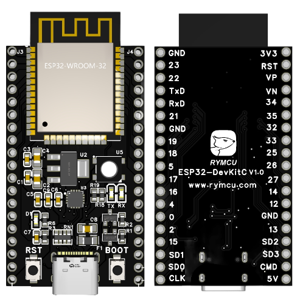

ESP32-DevKitC —— 是社区在乐鑫官方设计方案上进行升级后推出的一款基于 ESP32 模组的入门级开发板。

> 获取地址: [GitHub](https://github.com/rymcu/ESP32-Open) | [Gitee](https://gitee.com/rymcu/ESP32-Open) | [RYMCU](https://rymcu.com/product/4/#相关文档)

## 功能介绍

ESP32-DevKitC V4 开发板的主要组件、接口及控制方式见下。

| 主要组件            | 基本介绍                                                                      |
|-----------------|---------------------------------------------------------------------------|
| ESP32-WROOM-32  | 基于 ESP32 的模组。更多详情，请见 [《ESP32-WROOM-32 技术规格书》](https://espressif.com/sites/default/files/documentation/esp32-wroom-32_datasheet_cn.pdf)。                          |
| EN              | 复位按键。                                                                     |
| Boot            | 下载按键。按下 Boot 键并保持，同时按一下 EN 键（此时不要松开 Boot 键）进入“固件下载”模式，通过串口下载固件。           |
| USB-to-UART 桥接器 | 单芯片 USB-UART 桥接器，可提供高达 3 Mbps 的传输速率。                                      |
| USB Type-C 接口   | USB 接口，可用作电路板的供电电源，或连接 PC 和 ESP32-WROOM-32 模组的通信接口。                       |
| 5V Power On LED | 开发板通电后（USB 或外部 5 V），该指示灯将亮起。更多信息，请见 相关文档 中的原理图。                           |
| I/O             | 板上模组的绝大部分管脚均已引出至开发板的排针。用户可以对 ESP32 进行编程，实现 PWM、ADC、DAC、I2C、I2S、SPI 等多种功能。 |

## 排针

下表列出了开发板两侧排针（J1 和 J3）的名称和功能，排针名称如图 ESP32-DevKitC V4（板载 ESP32-WROOM-32） 中所示。

### J2

| 编号 | 名称   | 类型[^1] | 功能                                      |
|----|------|--------|-----------------------------------------|
| 1  | 3V3  | P      | 3.3 V 电源                                |
| 2  | EN   | I      | CHIP_PU, Reset                          |
| 3  | VP   | I      | GPIO36, ADC1_CH0, S_VP                  |
| 4  | VN   | I      | GPIO39, ADC1_CH3, S_VN                  |
| 5  | IO34 | I      | GPIO34, ADC1_CH6, VDET_1                |
| 6  | IO35 | I      | GPIO35, ADC1_CH7, VDET_2                |
| 7  | IO32 | I/O    | GPIO32, ADC1_CH4, TOUCH_CH9, XTAL_32K_P |
| 8  | IO33 | I/O    | GPIO33, ADC1_CH5, TOUCH_CH8, XTAL_32K_N |
| 9  | IO25 | I/O    | GPIO25, ADC1_CH8, DAC_1                 |
| 10 | IO26 | I/O    | GPIO26, ADC2_CH9, DAC_2                 |
| 11 | IO27 | I/O    | GPIO27, ADC2_CH7, TOUCH_CH7             |
| 12 | IO14 | I/O    | GPIO14, ADC2_CH6, TOUCH_CH6, MTMS       |
| 13 | IO12 | I/O    | GPIO12, ADC2_CH5, TOUCH_CH5, MTDI       |
| 14 | GND  | G      | 接地                                      |
| 15 | IO13 | I/O    | GPIO13, ADC2_CH4, TOUCH_CH4, MTCK       |
| 16 | D2   | I/O    | GPIO9, D2 [^2]                          |
| 17 | D3   | I/O    | GPIO10, D3 [^2]                         |
| 18 | CMD  | I/O    | GPIO11, CMD [^2]                        |
| 19 | 5V   | P      | 5 V 电源                                  |

### J3

| 编号 | 名称   | 类型 [^1] | 功能                                |
|----|------|---------|-----------------------------------|
| 1  | GND  | G       | 接地                                |
| 2  | IO23 | I/O     | GPIO23                            |
| 3  | IO22 | I/O     | GPIO22                            |
| 4  | TX   | I/O     | GPIO1, U0TXD                      |
| 5  | RX   | I/O     | GPIO3, U0RXD                      |
| 6  | IO21 | I/O     | GPIO21                            |
| 7  | GND  | G       | 接地                                |
| 8  | IO19 | I/O     | GPIO19                            |
| 9  | IO18 | I/O     | GPIO18                            |
| 10 | IO5  | I/O     | GPIO5                             |
| 11 | IO17 | I/O     | GPIO17 [^3]                       |
| 12 | IO16 | I/O     | GPIO16 [^3]                       |
| 13 | IO4  | I/O     | GPIO4, ADC2_CH0, TOUCH_CH0        |
| 14 | IO0  | I/O     | GPIO0, ADC2_CH1, TOUCH_CH1, Boot  |
| 15 | IO2  | I/O     | GPIO2, ADC2_CH2, TOUCH_CH2        |
| 16 | IO15 | I/O     | GPIO15, ADC2_CH3, TOUCH_CH3, MTDO |
| 17 | D1   | I/O     | GPIO8, D1 [^2]                    |
| 18 | D0   | I/O     | GPIO7, D0 [^2]                    |
| 19 | CLK  | I/O     | GPIO6, CLK [^2]                   |

## 管脚布局

## 相关文档
- [电路原理图](./pcb/SCH-ESP32-DevKitC.pdf)
- [PCB 源文件](./pcb/ESP32-DevKitC.epro)

## 脚注

[^1]: P：电源；I：输入；O：输出。

[^2]: 管脚 D0、D1、D2、D3、CMD 和 CLK 用于 ESP32 芯片与 SPI flash 间的内部通信，集中分布在开发板两侧靠近 USB 端口的位置。通常而言，这些管脚最好不连，否则可能影响 SPI flash/SPI RAM 的工作。

[^3]: 管脚 GPIO16 和 GPIO17 仅适用于板载 ESP32-WROOM 系列和 ESP32-SOLO-1 的开发板，板载 ESP32-WROVER 系列开发板的管脚 GPIO16 和 GPIO17 保留内部使用。
