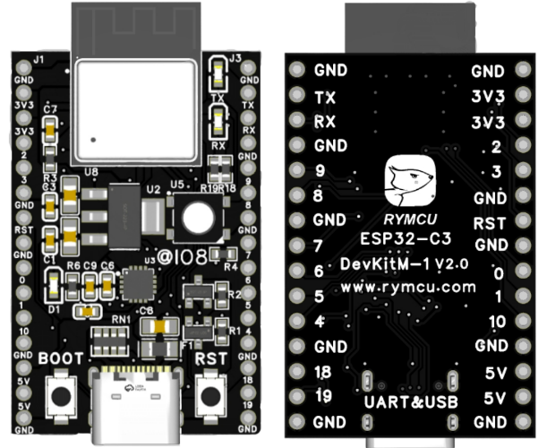

ESP32-C3-DevKitM-1 是社区在乐鑫官方设计方案上进行升级后推出的一款基于 ESP32-C3-MINI-1 模组的入门级开发板。

> 获取地址: [GitHub](https://github.com/rymcu/ESP32-Open) | [Gitee](https://gitee.com/rymcu/ESP32-Open) | [RYMCU](https://rymcu.com/product/5/#相关文档)

## 功能介绍

## 管脚布局

## 相关文档
- [电路原理图](./pcb/SCH-ESP32C3-DevKitM-1.pdf)

## 脚注