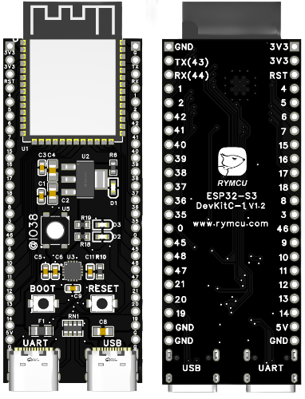

ESP32-S3-DevKitC-1 是社区在乐鑫官方设计方案上进行升级后推出的一款基于 ESP32-S3-WROOM-1/1U 或 ESP32-S3-WROOM-2/2U 模组的入门级开发板。

> 获取地址: [GitHub](https://github.com/rymcu/ESP32-Open) | [Gitee](https://gitee.com/rymcu/ESP32-Open) | [RYMCU](https://rymcu.com/product/2/#相关文档)

## 功能介绍

## 管脚布局

## 相关文档
- [电路原理图](./pcb/SCH-ESP32S3-DevKitC-1.pdf)

## 脚注